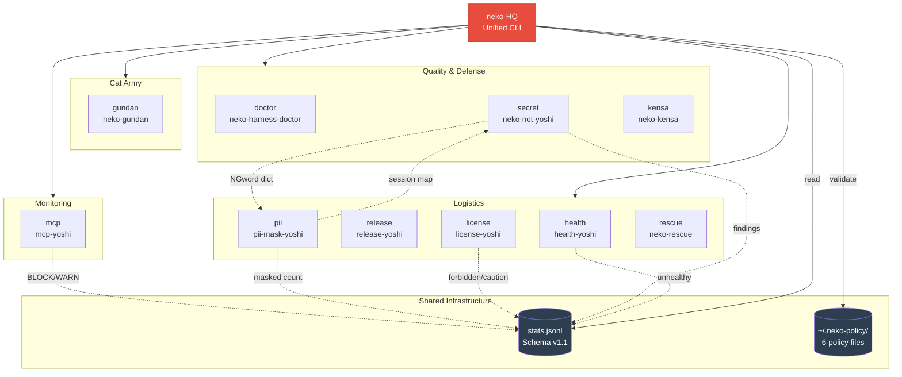

> English version: [README.md](README.md)

# neko-HQ

猫軍団エコシステムの統合CLI司令部。品質ツール（neko系）と兵站ツール（yoshi系）を一元管理する。

## インストール

```bash
git clone https://github.com/aliksir/neko-hq.git
cd neko-hq
```

依存パッケージなし（ゼロ依存設計）。

## 使い方

```bash
node bin/neko-hq.mjs <コマンド> [引数...]
```

### コマンド一覧

| コマンド | 説明 |
|---------|------|
| `status` | 全ツールの検出・稼働状況一覧 |
| `checkup` | ツール間の依存・設定の健全性チェック |
| `stats` | 実行統計ダッシュボード |
| `policy` | `.neko-policy/` ポリシーファイルの表示・検証 |
| `install <tool>` | ツール導入（git clone + npm install） |
| `update [tool]` | ツール更新（git pull --ff-only） |
| `config [tool]` | ツール設定確認・一覧 |
| `uninstall <tool>` | ツール退避（`_deleted/` に移動） |

### ツール一覧

**猫軍団本体**

| コマンド | ツール | 説明 |
|---------|--------|------|
| `gundan` | [neko-gundan](https://github.com/aliksir/neko-gundan) | 猫軍団マルチエージェントシステム |

**品質・防衛（neko系中核）**

| コマンド | ツール | 説明 |
|---------|--------|------|
| `doctor` | [neko-harness-doctor](https://github.com/aliksir/neko-harness-doctor) | CLAUDE.md/hooks/settingsの25項目診断 |
| `secret` | [neko-not-yoshi](https://github.com/aliksir/neko-not-yoshi) | PII・顧客名・秘密情報のpush前検出 |
| `kensa` | [neko-kensa](https://github.com/aliksir/neko-kensa) | デッドコード・循環依存・構造品質検査 |

**通信・監視**

| コマンド | ツール | 説明 |
|---------|--------|------|
| `mcp` | [mcp-yoshi](https://github.com/aliksir/mcp-yoshi) | MCP通信の監視・フィルタ・SIEM出力 |

**兵站（yoshi道具群）**

| コマンド | ツール | 説明 |
|---------|--------|------|
| `health` | [health-yoshi](https://github.com/aliksir/health-yoshi) | ローカルサービス死活監視+Telegram通知 |
| `release` | [release-yoshi](https://github.com/aliksir/release-yoshi) | version bump検出→git tag→GitHub Release |
| `license` | [license-yoshi](https://github.com/aliksir/license-yoshi) | 依存パッケージのライセンス判定（GPL汚染防止） |
| `pii` | [pii-mask-yoshi](https://github.com/aliksir/pii-mask-yoshi) | ファイル読取時のPII自動マスク（MCPサーバー） |
| `rescue` | [neko-rescue](https://github.com/aliksir/neko-rescue) | 壊れたClaude Codeセッションの復旧 |

## アーキテクチャ



### 使用例

```bash
# 全ツールの稼働状況を確認
node bin/neko-hq.mjs status

# ローカルサービスのヘルスチェック実行
node bin/neko-hq.mjs health

# 実行統計を表示
node bin/neko-hq.mjs stats

# health-yoshi の設定を確認
node bin/neko-hq.mjs config health

# 未導入ツールをインストール
node bin/neko-hq.mjs install license

# 全ツールを最新に更新
node bin/neko-hq.mjs update

# 特定ツールのみ更新
node bin/neko-hq.mjs update health
```

## 共通ログ (Schema v1.1)

全ツールの実行記録が `~/.neko-hq/stats.jsonl` に統合される。

### 基本フィールド（必須）

```json
{
  "schema_version": "1.1",
  "tool": "health-yoshi",
  "command": "health",
  "ts": "2026-06-07T09:45:00.000Z",
  "duration_ms": 1234,
  "exit_code": 0,
  "meta": {}
}
```

### 拡張フィールド（任意・v1.1）

各ツールは以下のフィールドを追加してリッチなレポートを生成できる:

| フィールド | 型 | 説明 |
|-----------|-----|------|
| `severity` | string | `"info"` / `"warn"` / `"error"` / `"block"` |
| `session_id` | string | セッション識別子 |
| `project` | string | プロジェクト名 |
| `summary` | object | ツール固有の集約情報 |
| `summary.findings` | number | 検出件数 |
| `summary.blocked` | number | ブロック件数 |
| `summary.warned` | number | 警告件数 |
| `summary.masked` | number | マスク件数 |

拡張フィールド付きの例（mcp-yoshi BLOCKイベント）:

```json
{
  "schema_version": "1.1",
  "tool": "mcp-yoshi",
  "command": "outbound",
  "ts": "2026-06-08T00:00:00.000Z",
  "duration_ms": 45,
  "exit_code": 0,
  "severity": "block",
  "summary": { "server": "suspicious-mcp", "findings": 3, "blocked": 1 },
  "meta": {}
}
```

### stats 出力例

```
neko-HQ stats
────────────────────────────────────────────────────────────
  Command     Runs    Success   Avg(ms)
────────────────────────────────────────────────────────────
  health      12      100%      1234
  doctor      5       80%       4567
────────────────────────────────────────────────────────────
  Total: 17 entries

Security Events
────────────────────────────────────────────────────────────
  BLOCK     3
  WARN      12

Summary (accumulated)
────────────────────────────────────────────────────────────
  findings      48
  blocked       3
  warned        12
```

## 動作要件

- Node.js 18+
- Git（`install` コマンド用）
- 各ツールが カレントディレクトリ配下に配置されていること（`NEKO_HQ_WORK_DIR` 環境変数で変更可能）

## ライセンス

MIT
