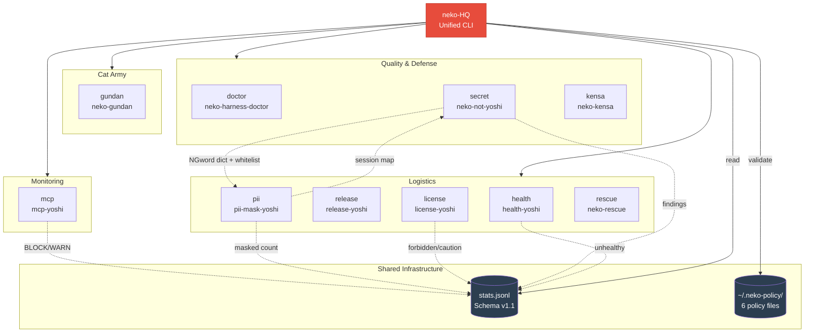

> 日本語版は [README.ja.md](README.ja.md) を参照してください。

# neko-HQ

Unified CLI headquarters for the neko-gundan (cat army) ecosystem. Manages quality tools (neko-*) and logistics tools (yoshi family) from a single entry point.

## Installation

```bash
git clone https://github.com/aliksir/neko-hq.git
cd neko-hq
```

No dependencies required (zero-dependency design).

## Usage

```bash
node bin/neko-hq.mjs <command> [args...]
```

### Commands

| Command | Description |
|---------|-------------|
| `status` | Show detection status of all tools |
| `checkup` | Dependency and configuration health check |
| `stats` | Execution statistics dashboard |
| `policy` | Show and validate `.neko-policy/` policy files |
| `install <tool>` | Install a tool (git clone + npm install) |
| `update [tool]` | Update tools (git pull --ff-only) |
| `config [tool]` | Show tool configurations |
| `uninstall <tool>` | Archive a tool (move to `_deleted/`) |

### Tools

**Cat Army (core)**

| Command | Tool | Description |
|---------|------|-------------|
| `gundan` | [neko-gundan](https://github.com/aliksir/neko-gundan) | Multi-agent system for AI coding agents |

**Quality & Defense (neko core)**

| Command | Tool | Description |
|---------|------|-------------|
| `doctor` | [neko-harness-doctor](https://github.com/aliksir/neko-harness-doctor) | CLAUDE.md/hooks/settings diagnostics (25 checks) |
| `secret` | [neko-not-yoshi](https://github.com/aliksir/neko-not-yoshi) | PII, customer names, and secrets pre-push detection (with at-rest encryption and whitelist) |
| `kensa` | [neko-kensa](https://github.com/aliksir/neko-kensa) | Dead code, circular deps, and structural quality checks |

**Monitoring**

| Command | Tool | Description |
|---------|------|-------------|
| `mcp` | [mcp-yoshi](https://github.com/aliksir/mcp-yoshi) | MCP communication monitoring, filtering, and SIEM export |

**Logistics (yoshi family)**

| Command | Tool | Description |
|---------|------|-------------|
| `health` | [health-yoshi](https://github.com/aliksir/health-yoshi) | Local service monitoring + Telegram alerts |
| `release` | [release-yoshi](https://github.com/aliksir/release-yoshi) | Version bump detection → git tag → GitHub Release |
| `license` | [license-yoshi](https://github.com/aliksir/license-yoshi) | Dependency license check (GPL contamination prevention) |
| `pii` | [pii-mask-yoshi](https://github.com/aliksir/pii-mask-yoshi) | Auto PII masking on file read with at-rest encryption (MCP server) |
| `rescue` | [neko-rescue](https://github.com/aliksir/neko-rescue) | Broken Claude Code session recovery |


## Architecture



### Examples

```bash
# Check all tool availability
node bin/neko-hq.mjs status

# Run health check on local services
node bin/neko-hq.mjs health

# View execution statistics
node bin/neko-hq.mjs stats

# Show health-yoshi configuration
node bin/neko-hq.mjs config health

# Install a missing tool
node bin/neko-hq.mjs install license

# Update all tools to latest
node bin/neko-hq.mjs update

# Update a specific tool
node bin/neko-hq.mjs update health
```

## Unified Logging (Schema v1.1)

All tool executions are recorded in `~/.neko-hq/stats.jsonl`.

### Required fields

```json
{
  "schema_version": "1.1",
  "tool": "health-yoshi",
  "command": "health",
  "ts": "2026-06-07T09:45:00.000Z",
  "duration_ms": 1234,
  "exit_code": 0,
  "meta": {}
}
```

### Optional fields (v1.1)

Tools may include additional fields for richer reporting:

| Field | Type | Description |
|-------|------|-------------|
| `severity` | string | `"info"` / `"warn"` / `"error"` / `"block"` |
| `session_id` | string | Session identifier |
| `project` | string | Project name |
| `summary` | object | Tool-specific aggregated info |
| `summary.findings` | number | Detection count |
| `summary.blocked` | number | Blocked count |
| `summary.warned` | number | Warning count |
| `summary.masked` | number | Masked count |

Example with extended fields (mcp-yoshi BLOCK event):

```json
{
  "schema_version": "1.1",
  "tool": "mcp-yoshi",
  "command": "outbound",
  "ts": "2026-06-08T00:00:00.000Z",
  "duration_ms": 45,
  "exit_code": 0,
  "severity": "block",
  "summary": { "server": "suspicious-mcp", "findings": 3, "blocked": 1 },
  "meta": {}
}
```

### Stats output

```
neko-HQ stats
────────────────────────────────────────────────────────────
  Command     Runs    Success   Avg(ms)
────────────────────────────────────────────────────────────
  health      12      100%      1234
  doctor      5       80%       4567
────────────────────────────────────────────────────────────
  Total: 17 entries

Security Events
────────────────────────────────────────────────────────────
  BLOCK     3
  WARN      12

Summary (accumulated)
────────────────────────────────────────────────────────────
  findings      48
  blocked       3
  warned        12
```

## Requirements

- Node.js 18+
- Git (for `install` command)
- Individual tools installed as sibling directories (defaults to cwd, configurable via `NEKO_HQ_WORK_DIR` env var)

## License

MIT
